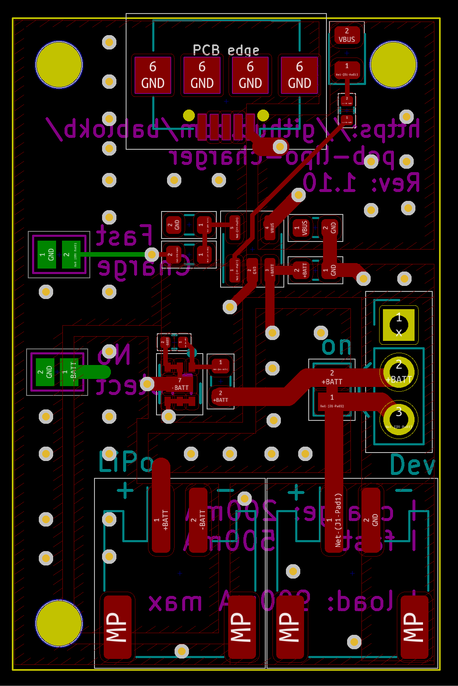
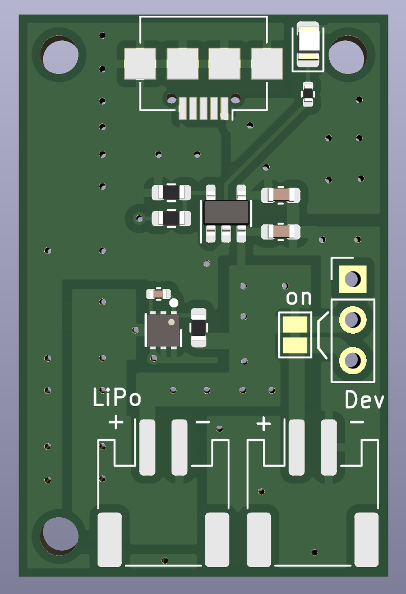
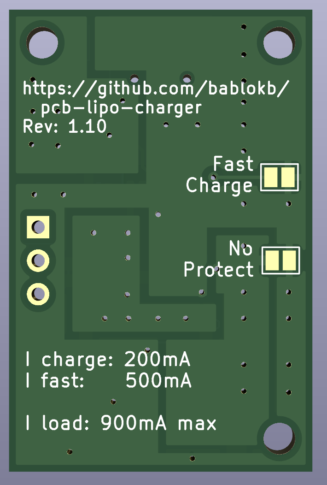

A small LiPo Charger using the MCP73831 and the XB6166IS
========================================================

Here are the KiCAD (v6) design-files for a small LiPo charger.
The charger supports charging with an attached load.

The charging IC is the MCP73831T-2ACI/OT. For details, see the
schematic.

For battery protection, the XB6166IS from XySemi is used.
Overcurrent detection kicks in at about 900mA, so this is
not a charger for high loads.

Schematic
---------

Layout
------

3D-Views
--------

License
-------

[![CC BY-SA 4.0][cc-by-sa-shield]][cc-by-sa]

This work is licensed under a
[Creative Commons Attribution-ShareAlike 4.0 International
License][cc-by-sa].

[![CC BY-SA 4.0][cc-by-sa-image]][cc-by-sa]

[cc-by-sa]: http://creativecommons.org/licenses/by-sa/4.0/
[cc-by-sa-image]: https://licensebuttons.net/l/by-sa/4.0/88x31.png
[cc-by-sa-shield]:
https://img.shields.io/badge/License-CC%20BY--SA%204.0-lightgrey.svg
